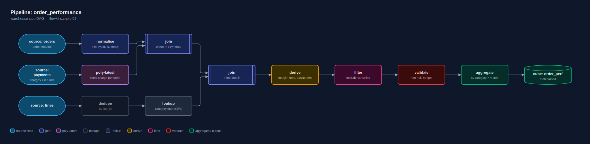
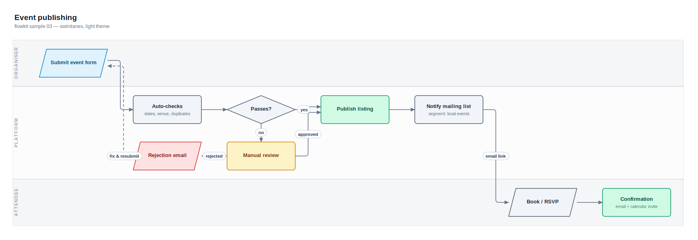
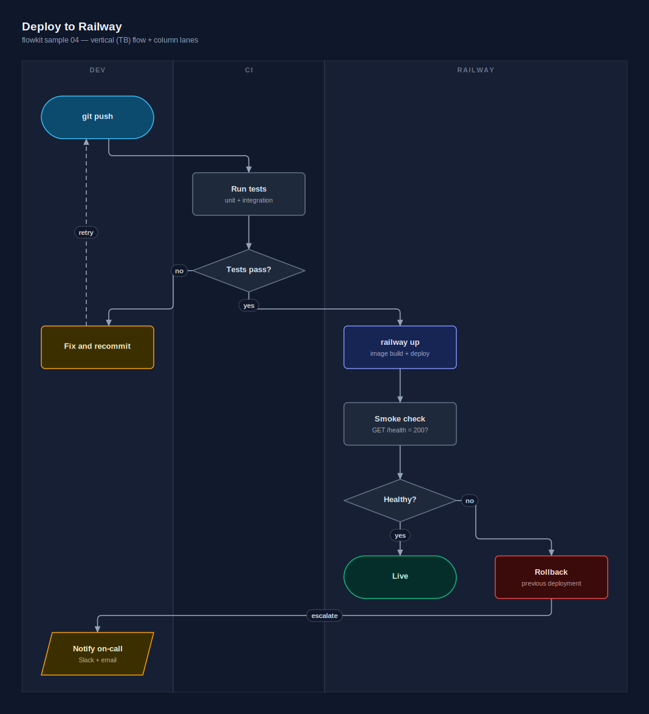
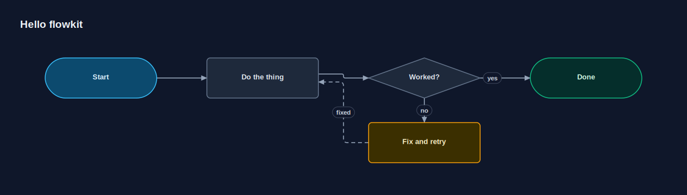

# flowkit

Deterministic, grid-based flowchart renderer. JSON in, SVG/PNG out.

Built for an AI-driven authoring loop: there is **no auto-layout**. The author
(human or AI) places every node on an explicit grid, edges route by fixed
documented rules, and the same chart always renders to the same pixels.
Feedback maps to numbers and enums, never to "drawing":

> "Swap those two boxes" → swap two `row` values. Nothing else moves.
> "That line is confusing" → set `exit`/`enter` sides or add a `via` cell.
> "Make the failure path red" → `"class": "danger"`.

This is the flowchart equivalent of the Plotly Sankey workflow: the data
structure *is* the layout.

## Gallery

Rendered straight from `samples/` — `npm run samples` reproduces every one of
these pixel-for-pixel.







The style sheet ([dark](docs/05-stylesheet.svg) · [light](docs/05-stylesheet-light.svg))
shows every shape, colour class and edge style on one canvas.

## Quick start

Node 18+ and a clone is all SVG output needs — the renderer has zero runtime
dependencies:

```bash
git clone https://github.com/startlingdan/flowkit.git
cd flowkit
node bin/flowkit.mjs render samples/01-decision.json --svg-only --out-dir out
# → out/01-decision.svg — open it in any browser
```

PNG output drives headless chromium through puppeteer. `npm install` pulls it
(a dev dependency); an install in any parent `node_modules` is picked up too,
and a system chromium is used when one exists (`FLOWKIT_CHROMIUM` overrides
the path). Then drop `--svg-only`:

```bash
node bin/flowkit.mjs render chart.json                 # writes chart.svg + chart.png next to it
node bin/flowkit.mjs render charts/*.json --out-dir out
node bin/flowkit.mjs validate chart.json               # check without rendering
node bin/flowkit.mjs transpose chart.json -o tb.json   # flip horizontal <-> vertical
# options: --svg-only   --theme dark|light   --scale N (png pixel density, default 2)
```

## Your first chart

Save this as `hello.json` — every node names its own grid cell (`col`, `row`):

```json
{
  "title": "Hello flowkit",
  "nodes": [
    { "id": "start", "col": 0, "row": 0, "shape": "terminal", "class": "primary", "label": "Start" },
    { "id": "work", "col": 1, "row": 0, "label": "Do the thing" },
    { "id": "ok", "col": 2, "row": 0, "shape": "decision", "label": "Worked?" },
    { "id": "done", "col": 3, "row": 0, "shape": "terminal", "class": "success", "label": "Done" },
    { "id": "retry", "col": 2, "row": 1, "class": "warning", "label": "Fix and retry" }
  ],
  "edges": [
    { "from": "start", "to": "work" },
    { "from": "work", "to": "ok" },
    { "from": "ok", "to": "done", "label": "yes" },
    { "from": "ok", "to": "retry", "label": "no" },
    { "from": "retry", "to": "work", "style": "dashed", "label": "fixed" }
  ]
}
```

```bash
node bin/flowkit.mjs render hello.json --svg-only
```



Three things just happened that define the tool:

- **You placed every node.** `col`/`row` are yours; there is no layout engine
  to fight.
- **The edges routed themselves** through the gaps between cells, following
  the fixed rules below — including the dashed loop-back finding its own way
  back around the decision.
- **Feedback is numeric.** Don't like a route or a colour? Change a number or
  an enum (`exit`, `enter`, `via`, `class` — see the
  [feedback vocabulary](REFERENCE.md#changing-a-chart-the-feedback-vocabulary))
  and re-render. Identical JSON gives identical pixels, every time.

(This chart ships as `samples/00-hello.json`.)

## Chart format

```jsonc
{
  "title": "Order processing",            // optional
  "subtitle": "v2 — June 2026",           // optional
  "theme": "dark",                        // dark | light (default dark)
  "direction": "LR",                      // LR (default) | TB — which axis auto-routing favours
  "grid": {                               // all optional, defaults shown
    "colWidth": 200, "rowHeight": 72,     // cell size (all cells uniform)
    "colGap": 90, "rowGap": 44            // gutters between cells (edges travel here)
  },
  "lanes": [                              // optional swimlanes: row bands (LR charts)...
    { "label": "Customer", "rows": [0, 1] },
    { "label": "Backend",  "rows": [2, 3] }
    // ...or column bands (TB charts): { "label": "CI", "cols": [1, 1] } — one kind per chart
  ],
  "legend": { "primary": "source", "danger": "validation" },   // optional class -> label chips
  "classes": { "happy": { "fill": "#052e2b", "stroke": "#10b981", "text": "#d1fae5" } }, // optional custom classes
  "fontFamily": "Georgia",                // optional custom font (built-in stack stays as fallback)
  "themeOverrides": { "bg": "#000000" },  // optional page-chrome retints (see REFERENCE.md)
  "nodes": [ ... ],
  "edges": [ ... ]
}
```

**Complete options reference for humans — every field, default, colour hex,
theme token and CLI flag: [REFERENCE.md](REFERENCE.md).** The rendered style
sheet (`samples/05-stylesheet*.json` → `out/`) shows every shape, class and
edge style in both themes.

### Nodes

```jsonc
{
  "id": "check",              // required, [A-Za-z0-9_-]+, unique
  "col": 2, "row": 0,         // required, non-negative integers; one node per cell
  "shape": "decision",        // process (default) | decision | terminal | io | data | subroutine | note
  "label": "Details valid?",  // wraps to fit the cell; keep decision labels short
  "sublabel": "fraud check",  // optional smaller second line(s)
  "class": "warning"          // default | primary | success | danger | warning | info | accent | pink | muted
}
```

Shapes: `process` rectangle · `decision` diamond · `terminal` stadium (start/end)
· `io` parallelogram (input/output) · `data` cylinder (store/queue)
· `subroutine` double-edged rectangle · `note` folded-corner card.

### Edges

```jsonc
{
  "from": "check", "to": "fix",
  "label": "no",              // optional; renders as a pill sitting on the line
  "labelAt": "start",         // start | mid | end (default mid; decision sources default start)
  "exit": "south",            // north/south/east/west — override which side the edge leaves
  "enter": "west",            // override which side it arrives at
  "via": [[3, 2]],            // optional [col,row] cells the route must pass through
  "style": "dashed",          // solid (default) | dashed | dotted
  "class": "danger"           // colours the line + arrowhead + label
}
```

## Routing rules (the predictability contract)

1. Sides are chosen from relative grid position when not overridden.
   `direction` picks the dominant axis for diagonal edges: in LR a
   down-right target means leave east / arrive west; in TB the same target
   means leave south / arrive north. Same row/column always routes direct.
2. An edge runs as a single straight line when the two anchors face each other
   on the same row/column and every cell between is empty.
3. Otherwise it travels the gutters between cells, entering them at fixed
   stub points, with at most the bends needed to reach the target side
   (a Z through the gutter next to the target when the corridor is clear,
   else around via the gutter nearest the target).
4. Edges sharing a gutter get parallel offsets (0, +8px, −8px, …) in the order
   they appear in the `edges` array.
5. Several edges on one side of a rectangle spread along that side, sorted by
   where the other end sits. Diamonds always connect at their four points.
6. `via` cells take full control: the route passes through each listed cell
   centre in order. Pick empty cells (the validator warns otherwise).

Because of 1–6, *where a line goes is a pure function of the JSON*. If a line
looks wrong, change the JSON; the renderer will never re-arrange anything by
itself.

## Authoring guide (for humans and AI sessions)

- Sketch the grid first: main flow left→right along row 0, branches/failure
  paths on rows below, merges back via explicit `enter` sides.
- Decisions: "yes" continues east, "no" drops south — convention, not enforced.
- Vertical charts: set `direction: "TB"`, run the main flow down a column,
  branch to side columns. "yes" continues south; give "no" an explicit
  `exit: "east"`/`"west"` so it doesn't share the diamond's south point with
  the yes path. Use `cols` lanes. Along-flow spacing now lives in `rowGap`.
- To flip an existing chart, `flowkit transpose` does the whole mechanical
  transform (positions, sides, vias, lanes, gaps) in one deterministic step.
- Loop-backs read best entering an unused side (often `enter: "north"` or
  `"west"`) with `style: "dashed"` when they're asynchronous.
- One concept per cell; if a label wraps past the box the renderer warns and
  tells you which knob to turn (shorten label / raise `rowHeight` / widen
  `colWidth`).
- Keep charts under ~25 nodes; past that, split the chart or use a Sankey.
- Always run `validate` (or just `render` — it validates first) and read the
  warnings; they speak grid language and say exactly what to fix.

## Samples

| file | exercises |
|---|---|
| `samples/00-hello.json` | the five-node starter from "Your first chart" |
| `samples/01-decision.json` | decisions, yes/no labels, loop-backs, retry cycles, all shapes |
| `samples/02-pipeline.json` | DAG fan-in/fan-out, per-type colour classes, legend |
| `samples/03-swimlanes.json` | row swimlanes, light theme, cross-lane edges |
| `samples/04-vertical.json` | `direction: TB`, column swimlanes, vertical conventions |

`flowkit transpose samples/01-decision.json` is the quickest vertical demo:
the whole order-processing chart flips orientation with no re-authoring.

Rendered outputs land in `out/` (`npm run samples`).

## Why not Mermaid / Graphviz / D2?

All auto-layout engines share one failure mode for this workflow: layout is a
global black box, so feedback has no knob. Moving one box means fighting the
solver (invisible edges, rank constraints), and any edit can reshuffle the
whole picture. The data-warehouse admin screen that prompted flowkit used
Mermaid and burned a string of commits on zoom hacks and layout fights before
this tool replaced it. `compare/graphviz-02.mjs` (`npm install` first — the
Graphviz engine is a dev dependency) renders sample 02 through real Graphviz
for a side-by-side: compact, but it silently reorders the sources and bends edges
diagonally — and there's no numeric way to say "don't".
